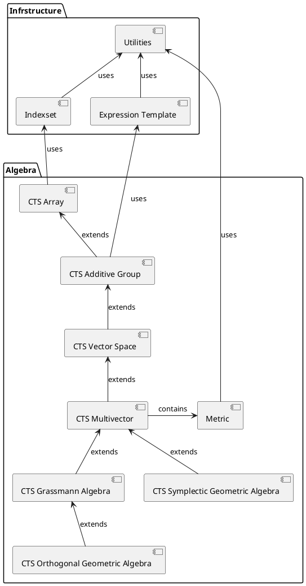

# 02-architecture.md

The library has two layers:

  - Infrastructure
  - Algebra
  
 ## Infrastructure Layer
 
 consists of the following modules: 
 
   - Utility general helpers
   - CTS Indexset
   - Expression Template Framework
 
 ## Algebra Layer

Conceptially all vectors are sparse maximum dimensional. where the maximum 
dimension is a compile time constant. All algebraic (multi-)vectors are embedded
within this space.

The metric is passed as in a context during assignment and in the usual case
taken from the assigned variables type at expression template evaluation..

Extends algebraic structures in consecutive steps (modules).

Pattern; Leaky Abstraction

Idioms:
   - CTS containers (vectors, multivectors)
   - Expression Templates (for (multi-)vectors
     - passing a context on assignment
     

