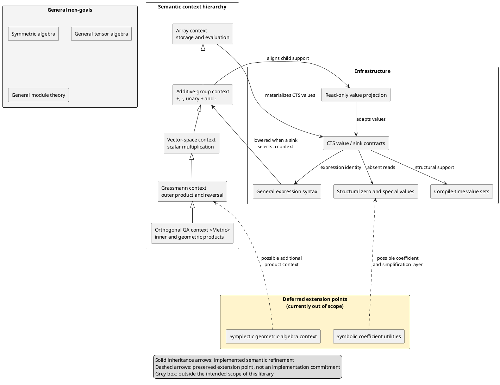

# Architecture

## Overview

The library separates the description of a computation from its algebraic
interpretation. A generic expression records syntax such as addition,
multiplication, or reversal. It does not decide what multiplication means.

The destination selects a semantic context when the expression is constructed
or assigned. That context lowers the generic syntax into a compile-time sparse
(CTS) expression whose nodes know their structural support and how to compute
each coefficient.

The architecture therefore has three conceptual regions:

- **Infrastructure** provides generic expression trees, compile-time value
  sets, structural zero, and sparse value/sink contracts.
- **Semantic contexts** interpret expressions in progressively richer
  algebraic structures.
- **Storage and evaluation** materialize a semantic expression by iterating its
  compile-time support.

## Layer diagram

## Infrastructure layer

### General expression syntax

The expression layer is intentionally algebra-neutral. It records the written
shape of an expression and owns its operands, but it does not propagate blade
indices or select an interpretation for multiplication.

This keeps syntax reusable. For example, the same multiplication node can be
interpreted as scalar multiplication by a vector-space context, an exterior
product by a Grassmann context, or a metric-dependent product by an orthogonal
geometric-algebra context.

### Compile-time sparse contracts

A CTS value carries a structural support set in its type. An index outside that
set is guaranteed to be identically zero. An index inside the set may evaluate
to zero or nonzero at runtime.

Values are readable at every index. Sinks are writable only at their populated
indices. Existing fully specified sinks require an exact structural-support
match on assignment, preventing accidental loss of coefficients.

Projection is a read-only value adapter. It may narrow a support set or widen
it by materializing structural zeros as ordinary runtime zeros. Because it is
not a writable alias, this does not weaken the sink contract.

## Semantic context hierarchy

Each context inherits the operations of the less general context below it and
adds only the rules belonging to its algebraic structure.

1. The **array context** supplies storage and coefficient-wise evaluation.
2. The **additive-group context** propagates support through addition,
   subtraction, and signs.
3. The **vector-space context** adds multiplication when at least one operand
   is scalar.
4. The **Grassmann context** adds the exterior product and blade reversal.
5. The **orthogonal geometric-algebra context** is parameterized by a diagonal
   metric and adds inner and geometric products.

This is a semantic hierarchy, not a hierarchy of runtime objects. Contexts are
small compile-time policies. A value does not need virtual functions or a
runtime algebra tag.

## Late semantic selection

The semantic context is chosen when a generic expression meets its sink. This
is the first point at which both pieces of necessary information are known:

- the expression supplies the operations and operands; and
- the sink family supplies the algebra in which those operations are meant.

The combination determines the semantic expression and its structural support.
Construction-time type deduction can then produce the complete sink type
without asking the user to spell out its index set.

## Scope boundaries

### Deferred extension points

The design should leave clean extension points for the following, but their
implementation is currently outside the project scope:

- a symplectic geometric-algebra context or other product contexts built on
  the common sparse/exterior infrastructure; and
- symbolic coefficients, symbolic simplification, and related facilities in
  the utility layer.

These extension points must not complicate the active implementation. Current
code may provide the necessary generic boundaries, but it should not add
unfinished symbolic or symplectic behavior to the supported API.

### General non-goals

The project is not intended to grow into a general computer-algebra framework.
In particular, the following are generally outside its scope:

- symmetric algebra;
- general tensor algebra; and
- general algebraic modules or module theory.

Supporting scalar multiplication in the vector-space sense does not imply a
goal of modeling arbitrary modules. Likewise, using tensor-like or symbolic
coefficient types as ordinary user-provided values does not make their
algebraic manipulation a responsibility of this library.
