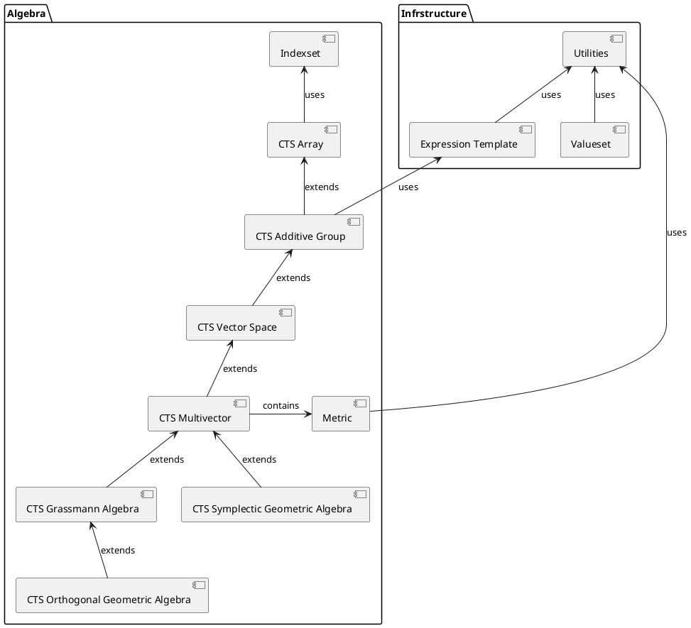

# Module Structure

## Directory Structure

    cts/
    ├── 00-README.md                               # this file
    ├── cts.cppm                                   # Primary module
    ├── utilities/
    │   ├── expression_templates.ixx               # Expression templates
    │   ├── special_values.ixx                     # compile time special values for 0, 1, -1
    │   └── utilities.ixx                          # Base utilities
    ├── algebra/
    │   ├── metric.ixx                             # Metric tensor
    │   ├── array.ixx                              # CTS Array
    │   ├── additive_group.ixx                     # Additive Group
    │   ├── vector_space.ixx                       # Vector Space
    │   ├── multivector.ixx                        # Multivector
    │   ├── grassmann.ixx                          # Grassmann Algebra
    │   ├── orthogonal_ga.ixx                      # Orthogonal Geometric Algebra
    │   └── symplectic_ga.ixx                      # Symplectic Geometric Algebra
    └── valueset/
        └── valueset.ixx                           # Indexset (separate folder)

## Architecture

